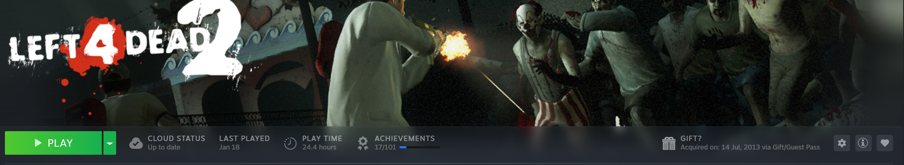
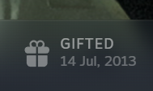

# Gratitude - Gifted Games Reminder

**Gratitude** is a [Millennium](https://steambrew.app/) plugin for your Steam Library that adds a helpful indicator to games you have been gifted.

## Screenshots

  
   
  <em>The plugin integrates seamlessly with the existing Steam game header.</em>

  

---

## ⚠️ Early Access Note
This is an early release with one known temporary limitation:  

* **Store Sync:** Currently, you **must visit the Steam Store** at least once after starting Steam for the plugin to fetch your gift history. If indicators aren't showing up, simply click the "Store" tab and then return to your Library.  
* **Status:** I am actively working on a fix for this to automate the data fetch in the next release!  

---

## 🛠 Installation

> [!IMPORTANT]
> **Millennium is required.** This plugin will only work if you have the Millennium framework installed. If you haven't, visit [steambrew.app](https://steambrew.app/) first.

1.  **Download the Plugin:**
    * Click the **Releases** section on the right side of this repository.
    * Under the latest version, look for the **Assets** dropdown.
    * Download the file named `gratitude-for-millenium-<version>.zip`.
2.  **Locate Plugins Directory:**
    * Go to your Steam installation folder (often `C:\Program Files (x86)\Steam\plugins`). 
    * *Note: This folder is only created after Millennium has been installed and run for the first time.*
3.  **Extract:**
    * Extract the contents of the ZIP file into a new folder within that `plugins` directory.
4.  **Restart Steam:**
    * Once Steam restarts, Millennium will load the plugin automatically.

---

# FAQ
**Q: Is Millennium allowed by Valve? (Will I get banned?)**   
A: Using Millennium to customize your client is safe. As noted on the [Official Valve Software Wiki](https://developer.valvesoftware.com/wiki/Steam_Skins):   
> "As the official skin support (for VGUI) has been removed... it was unofficially replaced by Millennium for Steam... an open source patcher that allows skins/themes after April 27th 2023."

**Q: Can I find this in the [Millennium Plugins Browser](https://steambrew.app/plugins)?**  
A: Not yet; once I've polished this up further, I will submit it for review to be added to the official store.  

**Q: Can it show who gifted me the game?**  
A: Unfortunately not. Outside of the original gift message and email, Steam does not store the "sender" information in a way the client can retrieve, so I cannot display it.

## Acknowledgments
A special thanks to **[HLTB for Millennium](https://github.com/jcdoll/hltb-millennium-plugin)** for executing another plugin which places game-specific tooltips: it made a great study/starting out point, especially for the observer and injection logic.
