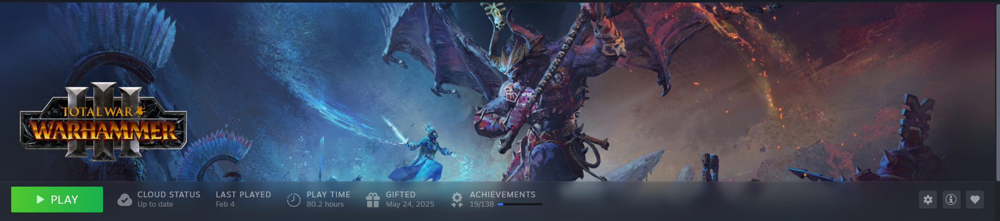
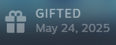
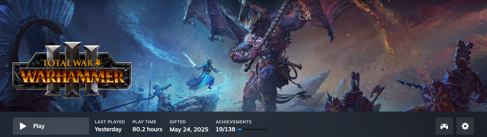
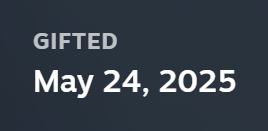

# Gratitude - Gifted Games Reminder

**Gratitude** is a [Millennium](https://steambrew.app/) plugin for your Steam Library that adds a helpful indicator to games you have been gifted.

## Screenshots

  
   
  <em>The plugin integrates seamlessly with the existing Steam game header.</em>

  

### Big Picture Mode

Gratitude also works in Big Picture mode, providing the same gift information when browsing your library on the big screen.

  
   
  <em>Full Big Picture mode support for couch gaming.</em>

  

### Gift Labeling 
Ever forgotten who gave you a game?

| | |
|:---|:---:|
| Click the gift icon on any gifted game to open a details panel where you can record the gifter and add a personal note. |  |
|  | The gifter field uses smart autocomplete against your Steam friends list, so you can find the right person without typing their full name. |
| Once saved, the gifter's name shows up right in the tooltip so you never forget again! |  |

## 🛠 Installation

> [!IMPORTANT]
> **Millennium is required.** This plugin will only work if you have the Millennium framework installed. If you haven't, visit [steambrew.app](https://steambrew.app/) first.

### Either: 
1.  **Install from the Gratitude plugin page:**
    * Open [Gratitude on steambrew.app](https://steambrew.app/plugin?id=a0f319c49e93).
    * Use the install flow there. This is the recommended way to install the plugin.

Or:
1.  **Manual install fallback:**
    * Click the **Releases** section on the right side of this repository.
    * Under the latest version, look for the **Assets** dropdown.
    * Download the file named `gratitude-for-millenium-<version>.zip`.
2.  **Locate Plugins Directory:**
    * Go to your Steam installation folder (often `C:\Program Files (x86)\Steam\plugins`). 
    * *Note: This folder is only created after Millennium has been installed and run for the first time.*
3.  **Extract:**
    * Extract the contents of the ZIP file into a new folder within that `plugins` directory.
4.  **Restart Steam (if it was open):**
    * Once Steam restarts, Millennium will load the plugin but it still needs to be enabled.
5.  **Enable the Plugin:**
    * Go to **Steam** → **Millennium** → **Plugins** in the menu bar.
    * Find **Gratitude** in the list and toggle it on.
    * "Save Changes"

---

# FAQ
**Q: Is Millennium allowed by Valve? (Will I get banned?)**   
A: Using Millennium to customize your client is safe. As noted on the [Official Valve Software Wiki](https://developer.valvesoftware.com/wiki/Steam_Skins):   
> "As the official skin support (for VGUI) has been removed... it was unofficially replaced by Millennium for Steam... an open source patcher that allows skins/themes after April 27th 2023."

**Q: Does this work in Big Picture mode?**  
A: Yes! Gratitude fully supports both the standard Steam library and Big Picture mode.

**Q: Why isn't the gift display loading or isn't showing for a game I was just gifted?**  
A: Try visiting the Steam Store in your client, then go back: This plugin stores your game license data but can only do so when you visit one of Steam's non-library pages.

**Q: Can it show who gifted me the game?**  
A: Yes, with a little help from you! Steam doesn't store sender information in a way the client can retrieve, but you can label it yourself. Click the `Gifted` tooltip on any gifted game in your Library to open the details panel, where you can select the gifter from your Steam friends list and add a personal note. Once saved, the gifter's name will appear in the tooltip.

## Acknowledgments

A special thanks to **[HLTB for Millennium](https://github.com/jcdoll/hltb-millennium-plugin)** for executing another plugin which places game-specific tooltips: it made a great study/starting out point, especially for the observer and injection logic.

This project uses the **IoGiftSharp** icon from **[Ionicons](https://ionic.io/ionicons)** via **[react-icons](https://react-icons.github.io/react-icons/)**.  
Ionicons and react-icons are licensed under the **MIT License**.
