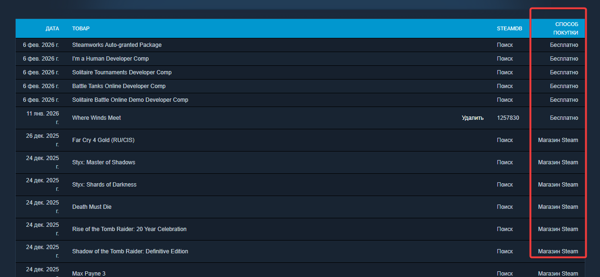
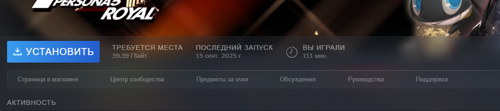

# TODO
- [x] Get user consent for persisting game license data to file (required for millenium plugin DB submission)
- [x] Persist data to Millennium approved dir (currently steam config folder) (chose `F:\Program Files (x86)\Steam\plugins\gratitude` with a fallback of `F:\Program Files (x86)\Steam\plugins\`)
- [x] Make non-loaded cache more obvious
- [x] Make game license data cache per-steamID (bug right now if you swap accounts, shows previous accounts gifts as yours if you own same game)
- [x] Standardise date format (Last Played is Mar 5, 2025 while Gratitude is 5 Mar, 2025)
- [x] Submit to [Millennium Plugin DB](https://github.com/shdwmtr/plugdb)
- [ ] Fix functionality for non-english steam clients
  - License data has non-english "acquired" method field 
  - License data has english game name but non-english library game name 
- [ ] Gifted tooltip doesn't show until you've played a game (because of Last Played selector)

# Long term
- [ ] Widen scope and show icons for all license types, configurable by settings (people requested knowing when they bought a game, not just gifts, which this plugin could definitely do)
- [ ] Confugrable icon for gift?
